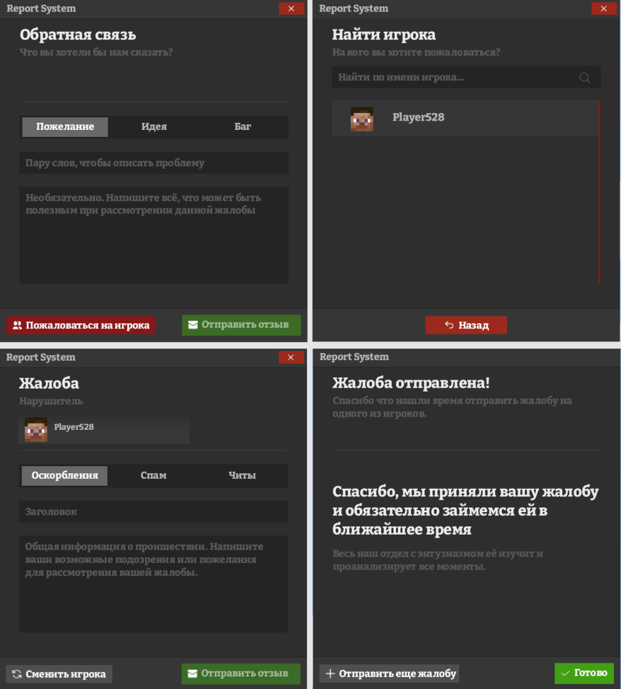

# FoxySister(VIZZI) COMMERCIAL
Всем привет, меня зовут Лисица и я java-разработчик. Предоставляю услуги в сфере майнкрафт-моддинга.
Верстаю дизайны, пишу сложные механики.  
ВК - [***тык***](https://vk.com/dendipro18)  
Discord - Лисица Сестрица(VIZZ9)#7038
# Услуги

1. __Разработка модификаций FORGE любой сложности на версию 1.7.10.__
2. __Исправление багов/дюпов/крашей/ недочётов модификаций.__
3. __Продажа готовых(самописных) модификаций для серверов.__
4. Разработка DISCORD ботов (Java) с поддержкой/расширением.
5. Настройка/установка серверов 1.7.10, 1.12.2, настройка/установка плагинов.
6. Установка/настройка/поддержка работоспособности GravitLauncher.

>__ПРЕДОСТАВЛЯЮ ПОЛНУЮ ЗАЩИТУ: РАЗДЕЛЕНИЕ КЛИЕНТ-СЕРВЕР, ОБФУСКАЦИЯ__
__РАБОТАЮ С ТЗ И БЕЗ. СРОКИ И ЦЕНА БЕЗ ТЗ БУДЕТ ВЫШЕ. РАБОТАЮ БЫСТРО.__

Оплату принимаю на _QIWI_, _Банк Украины_. 

# Мои работы
1. __[ГУИ/CЕРВЕР]__ (1.7.10) ReportSystem, отправка фидбека и жалоб в дискорд  

2. __[ГУИ/КЛИЕНТ]__ (1.7.10) MainMenuGameOfTrones, изменённые дефолтные гуи майнкрафта.

3. __[АДДОН/СЕРВЕР]__ (1.7.10) DraconicSkin, мод-аддон для Draconic Evolution. Реализовано: изменения модельки для Посоха.  

4. __[ГУИ/CЕРВЕР]__ (1.7.10) Skillmenu, мод который добавляет прокачку скилов.  

# В разработке
1. __[МОД/CЕРВЕР]__ (1.7.10) AdminSystem, мощная утилита для взаимодействия с игроком(бан,кик,просмотр любых инвентарей игрока, информация о приватах, скриншоты...  

2. __[ГУИ/CЕРВЕР]__ (1.7.10) BaseSystem, мод который добавляет возможность покупки базы(покупка дополнительных сундуков, добавление участников).  

